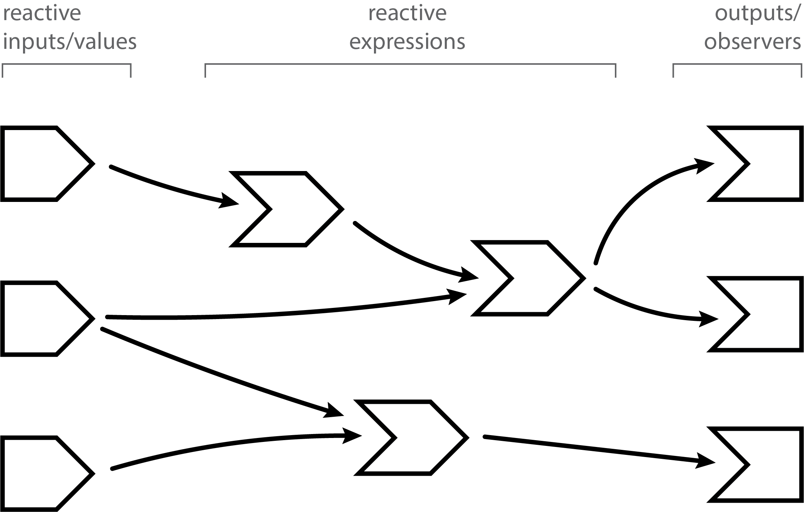
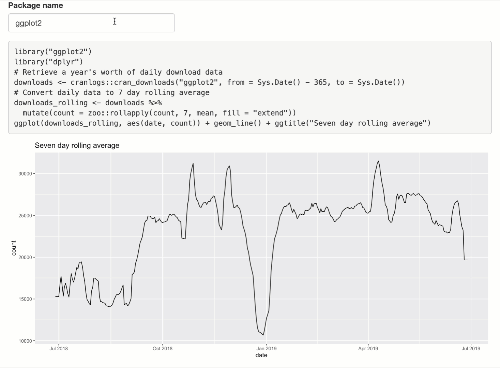

```{r setup, include=FALSE}
knitr::opts_chunk$set(
  comment = "#>",
  collapse = TRUE,
  message = FALSE,
  fig.align = "center",
  out.width = "80%"
)
library(shiny)
library(shinymeta)
library(dplyr)
library(ggplot2)
options(shiny.suppressMissingContextError = TRUE)
input <- list(package = "ggplot2")
output <- list()

# Only show the first few rows
library(knitr)
knit_print.data.frame <- function(x, ...) {
  if (nrow(x) > 10) {
    normal_print(head(x, 6))
    cat("[...plus", nrow(x) - 6, "more rows...]\n")
  }
}
# register the method
registerS3method("knit_print", "data.frame", knit_print.data.frame)
```

```{css echo=FALSE}
pre {
  border: 1px solid #eee;
}

pre.r {
  background-color: #ffffff;
}

pre.r code {
  background-color: #ffffff;
}

pre.R {
  background-color: #f8f8f8;
  border-radius: 0px;
  border-bottom-left-radius: 4px;
  border-bottom-right-radius: 4px;
}

.sourceCode .R {
  margin-top: -1em;
}
```

Here's a reduced version of the [cranview](https://github.com/cpsievert/cranview) Shiny app that allows you to enter an R package name to generate a plot of its CRAN downloads over the past year. This app will help us demonstrates how **shinymeta** can help us create a Shiny app that generates R code to reproduce the things within the shiny app (for example, `output$plot`), without having to repeat any of the app's core logic.

```{r, eval = FALSE}
library(shiny)
library(ggplot2)
library(dplyr)

ui <- fluidPage(
  textInput("package", "Package name", value = "ggplot2"),
  plotOutput("plot")
)

server <- function(input, output, session) {
  
  downloads <- reactive({
    # Retrieve a year's worth of daily download data
    cranlogs::cran_downloads(input$package, from = Sys.Date() - 365, to = Sys.Date())
  })
  
  downloads_rolling <- reactive({
    # Convert daily data to 7 day rolling average
    downloads() %>% mutate(count = zoo::rollapply(count, 7, mean, fill = "extend"))
  })
  
  output$plot <- renderPlot({
    ggplot(downloads_rolling(), aes(date, count)) + geom_line() + ggtitle("Seven day rolling average")
  })
}

shinyApp(ui, server)
```

Below is one way the app above could be modified to generate code that reproduces `output$plot` outside of the shiny session. Notice how both the `output$plot` and `output$code` update dynamically in response to new package names without having to repeat any logic of the original app. To keep the focus on code generation, we've presented the `output$code` as simple as possible here (by using `verbatimTextOutput()` and `renderPrint()`), but the [next article](02-code-distribution.html) outlines the various options for presenting and distributing code to users with **shinymeta**.

```{r, eval = FALSE}
library(shiny)
library(ggplot2)
library(dplyr)
library(shinymeta)

ui <- fluidPage(
  textInput("package", "Package name", value = "ggplot2"),
  verbatimTextOutput("code"),
  plotOutput("plot")
)

server <- function(input, output, session) {
  downloads <- metaReactive({
    "# Retrieve a year's worth of daily download data"
    cranlogs::cran_downloads(!!input$package, from = Sys.Date() - 365, to = Sys.Date())
  })
  
  downloads_rolling <- metaReactive({
    "# Convert daily data to 7 day rolling average"
    !!downloads() %>% mutate(count = zoo::rollapply(count, 7, mean, fill = "extend"))
  })
  
  output$plot <- metaRender(renderPlot, {
    ggplot(!!downloads_rolling(), aes(date, count)) + geom_line() + ggtitle("Seven day rolling average")
  })
  
  output$code <- renderPrint({
    expandObjects(
      downloads(),
      downloads_rolling(),
      output$plot(),
      .pkgs = c("ggplot2", "dplyr")
    )
  })
}

shinyApp(ui, server)
```

```{r, echo = FALSE}
knitr::include_graphics("cranview-basic.gif")
```

So, what has changed in the implementation between the original Shiny app and the one that generates code? There a few high-level observations we can make here that should hold true for most apps that leverage **shinymeta** to generate code:

* Each `reactive()` has changed to `metaReactive()`, and the `renderPlot()` function has been jammed into a `metaRender()` function.
    * Note: this example doesn't use `observe()`, but this document [covers their meta variant as well](#observers). 
* Each read of a `metaReactive()` or an `input` value has been prepended with `!!`.
* Comments are retained by surrounding them in quotes.
* The `expandObjects()` function generates code from a chain of meta-reactives (e.g., `downloads()` -> `downloads_rolling()` -> `output$plot()`).

On the surface, these changes look somewhat straight-forward, but in order to really understand how it all fits together, we'll have to unpack a handful of pretty sophisticated concepts related to metaprogramming (i.e., writing code that generates code). If you're new to metaprogramming, and you're serious about using **shinymeta**, we recommend reading [Advanced R](https://adv-r.hadley.nz) (especially the [Quasi-quotation chapter](https://adv-r.hadley.nz/quasiquotation.html)), but that shouldn't be necessary to get the gist of what's happening in this article.

## Meta-reactives

Let's start with this particular reactive expression from the original app:

```{r}
downloads <- reactive({
  cranlogs::cran_downloads(input$package, from = Sys.Date() - 365, to = Sys.Date())
})
downloads()
```

Reactive expressions are fantastic at the job they were designed for: lazy, caching, reactivity-aware calculators of results. However, they don't help in the second part of our goal, which is extracting the essential logic of the app, and making it reusable for others outside of shiny.

Enter `metaReactive()`. Let's do nothing besides change `reactive()` to `metaReactive()`:

```{r}
downloads <- metaReactive({
  cranlogs::cran_downloads(input$package, from = Sys.Date() - 365, to = Sys.Date())
})
```

In normal usage, the behavior of `downloads()` doesn't change at all -- it still works exactly the same as it lazily, cachingly, reactivity-aware-ingly calculates results.

```{r}
downloads()
```

However, when invoked with **shinymeta**'s meta-mode enabled (i.e., `withMetaMode()`), the behavior changes: Instead of evaluating the reactive expression and returning the value (a data frame), it returns a code expression.

```{r, class.output='R', comment = ''}
withMetaMode(downloads())
```

Notice how the generated code depends on the input variable `input$package`. If we were to run this code in a new R session, it would error because `input$package` isn't defined outside of the shiny session. We can, however, replace the literal name "`input$package`" with the value it represents (by unquoting it with `!!`), which allows the code to run a context where `input` isn't defined. 

## Unquoting with `!!` {#unquoting}

In computing, functions that return code expressions (e.g., `metaReactive()`) are called quoting functions. Since **shinymeta** supports [tidy evaluation](https://tidyeval.tidyverse.org/), quoting functions are also quasi-quoting functions, meaning they allow you to selectively evaluate (i.e., unquote or expand) parts of a quoted expression. For simple example, consider the `expr()` function from the **rlang** package which allow you to create code expressions:

```{r, class.output='R', comment = ''}
library(rlang)

a <- 2
expr(a + 1)
```

One way to produce an equivalent code expression that doesn't depend on the object `a` existing would be to use the `!!` operator to unquote (aka, evaluate or expand) the symbol `a`, which replaces it with the value it represents:

```{r, class.output='R', comment = ''}
expr(!!a + 1)
```

The idea is essentially the same when we wish to insert the value of `input$package` into the code rather than the literal name "`input$package`".^[This is so common that you should be a bit skeptical if you see `input$xxx` without `!!` inside of any meta-reactive.]

```{r, class.output='R', comment = ''}
downloads <- metaReactive({
  cranlogs::cran_downloads(!!input$package, from = Sys.Date() - 365, to = Sys.Date())
})
withMetaMode(downloads())
```

Depending on the ultimate purpose of the script we generate, we may or may not also want to replace a `Sys.Date()` call (which returns the current date) the actual value (at run time). For example, we produce code that acquires downloads starting `from` a year prior to the date the code _was generated_ and `to` whenever the code is _actually run_. The former requires us to un-quote `Sys.Date()` whereas the latter doesn't.

```{r, class.output='R', comment = ''}
# Ask yourself: what's the difference between `rlang::expr(!!Sys.Date() - 365)` and `rlang::expr(!!(Sys.Date() - 365))`?
# Why is that difference important in this case?
downloads <- metaReactive({
  cranlogs::cran_downloads(!!input$package, from = !!(Sys.Date() - 365), to = Sys.Date())
})
withMetaMode(downloads())
```

Whoa, what's this `structure()` business? Well, it's an unfortunate consequence of deparsing values that contain attributes (e.g., `deparse(Sys.Date())`), and deparsing is necessary for [supporting comments](#comments) and formatting code. In this case, since the `from` argument accepts string in `"yyyy-mm-dd"` format (i.e., the `Date` class isn't necessary), we can use `format()` to coerce the `Date` object into a string (and thus, more human-readable).

```{r, class.output='R', comment = ''}
downloads <- metaReactive({
  cranlogs::cran_downloads(!!input$package, from = !!format(Sys.Date() - 365), to = Sys.Date())
})
withMetaMode(downloads())
```

> #### Takeaway: unquote reactive inputs/values (e.g., `!!input$package`)

In summary, unquoting replaces a name with the value that it represents; and thus, is a essential tool for generating code that can run outside of a shiny session. That's because, in a shiny app, we often refer to reactive values that are only defined inside a shiny runtime. Unquoting is fairly straightforward when the name you're unquoting (`e.g. input$package`) represents a constant value (e.g. `"ggplot2"`), but become more complicated when those values become more complicated. In the next section, we'll be chaining meta-reactive expressions, which requires unquoting names that represent meta-reactives. That means, these names can actually represent un-evaluated expressions!

## Chaining meta-reactives {#chaining-meta-reactives}

Chaining of reactive expressions is a very useful pattern that allows Shiny to intelligently cache computations for you. Note that our example app has a reactive chain: the acquistion of daily downloads is done in one reactive expression, `downloads()`, then `downloads_rolling()` uses the return value of `downloads()` to compute a weekly rolling average:

```{r}
downloads_rolling <- metaReactive({
  downloads() %>% mutate(count = zoo::rollapply(count, 7, mean, fill = "extend"))
})
```

Recall that, when invoked with [meta-mode](#meta-mode) enabled, `metaReactive()`, like `rlang::expr()`, quotes its input, which is why `downloads()` appears in the code produced by `downloads_rolling()`:

```{r, class.output='R', comment = ''}
withMetaMode(downloads_rolling())
```

So, similar to the problem we had before with `input$package`, the generated code relies on something that won't be defined in a new R session (`downloads()`). However, by unquoting `downloads()`, we can replace it with the value it represents. Since `downloads()` is a `metaReactive()`, when meta-mode is enabled, that value represents the unevaluated expression that `withMetaMode(downloads())` returns:

```{r, class.output='R', comment = ''}
downloads_rolling <- metaReactive({
  !!downloads() %>% mutate(count = zoo::rollapply(count, 7, mean, fill = "extend"))
})
withMetaMode(downloads_rolling())
```


> #### Takeaway: unquote meta-reactive reads (i.e., `!!downloads()`) that appear within other meta-reactives


## Other meta-reactives (observers & outputs) {#observers}

So far we've learned how to manage reactive values (e.g., `input$package`) and reactive expressions (e.g., `downloads()`), but what about code captured in the endpoints of shiny's reactivity model (i.e. observers and outputs)?

```{r, echo = FALSE, out.width="60%"}

```

#### Observers

Creating a meta variant of `observe()` is very similar to creating a meta variant of `reactive()`: use `metaObserve()` instead of `observe()` and unquote any references to reactive values or expressions. Note that, outside of meta mode, `metaObserve()` behaves the same as `observe()`: it immediately evaluates the given expression (i.e., there's no need to invoke `msgObs()` outside of meta mode).

```{r, class.output='R', comment = ''}
msgObs <- metaObserve({
  d <- !!downloads()
  message(!!input$package, " has an daily download average of ", mean(d$count))
})
withMetaMode(msgObs())
```

The traditional `observe()` function returns an object that can be used to control aspects of the observer, though most Shiny apps don't bother to save it. See `?observe` for the different methods available. The object returned from `metaObserve()` can be used in the same way (`msgObs$suspend()`, for example) but has the additional capability of being called like a function, as in the previous code example.

#### Outputs

Since package authors are allowed to create their own output rendering functions, creating a meta variant of an output renderer (e.g. `renderPlot()`) needs to be more general than prefixing `meta` to the function name (as we did with `metaReactive()` and `metaObserve()`). Therefore, **shinymeta** has a general-purpose `metaRender()` function that anticipates a rendering function in it's first argument, and an expression in the second argument. Here's how we can make a meta variant of the CRAN downloads plot:

```{r, class.output='R', comment = ''}
output$plot <- metaRender(renderPlot, {
  ggplot(!!downloads_rolling(), aes(date, count)) + geom_line() + ggtitle("Seven day rolling average")
})
```

Similar to `metaReactive()` and `metaObserve()`, when meta mode is enabled, you can call `output$OUTPUT_ID()` to get an unevaluated expression.^[If meta mode is not enabled, `output$OUTPUT_ID()` will intentionally produce an error.]

```{r, class.output='R', comment = ''}
withMetaMode(output$plot())
```

(`metaRender()` makes some assumptions about the arguments taken by the render function, assumptions that we believe are true for all existing render functions. If you encounter a render function that doesn't seem to work properly with **shinymeta**, please let us know by [filing an issue on GitHub](https://github.com/rstudio/shinymeta/issues).)


## Ignoring non-meta code

Often times, in more sophisticated apps, you'll want to completely ignore part(s) of a reactive expression that are only relevant inside a shiny runtime. One common example is Shiny's input validation helpers (e.g. `validate()`, `need()`, and `req()`), which you probably don't want to include in your generated code. For this reason, **shinymeta** provides a second version of each meta-reactive (e.g., `metaReactive2()`, `metaObserve2()`, `metaRender2()`, etc), which allows you capture a specific subset of a reactive expression via `metaExpr()` (otherwise, they behave exactly the same). 

To demonstrate, our example app could make use of `validate()` and `need()` to improve the user experience of our app, since currently, it errors out when a user hasn't specified a package name.

```{r, echo = FALSE}

```

To avoid including `validate()` and `need()` in the generated code, change `metaRender()` to `metaRender2()`, then wrap the plot generation code in `metaExpr()`. It's important to note that, when using these `-2` variants (i.e., `metaRender2()`, `metaReactive2()`, etc), _only the code within `metaExpr()` is evaluated with meta-mode enabled_. This means, in the example below, the `validate()` conditions run exactly how you'd expect them to without **shinymeta**. In particular, the read of `downloads()` that appears inside the `validate()` condition always returns a data frame, even if we read `output$plot()` with meta-mode enabled.

```{r, class.output='R', comment = ''}
output$plot <- metaRender2(renderPlot, {
  validate(
    need(input$package, "Please provide a package name"),
    need(nrow(downloads()) > 0, "Please provide a valid package name")
  )
  
  metaExpr({
    ggplot(!!downloads_rolling(), aes(date, count)) + geom_line() + ggtitle("Seven day rolling average")
  })
})

withMetaMode(output$plot())
```

It isn't really needed in this case, but you could also re-work `downloads()` and `downloads_rolling()` to perform input validation:

```{r}
downloads <- metaReactive2({
  req(input$package)
  
  metaExpr({
    cranlogs::cran_downloads(!!input$package, from = Sys.Date() - 365, to = Sys.Date())
  })
})

downloads_rolling <- metaReactive2({
  req(downloads())
  
  metaExpr({
    !!downloads() %>% mutate(count = zoo::rollapply(count, 7, mean, fill = "extend"))
  })
})
```

It's important to note that these `...2` variants expect their return value to be a `metaExpr()`. If you find yourself in the situation where that `metaExpr()` should change depending on some sort of control flow (e.g., `if` statements), you may want to use a pattern [similar to this](https://github.com/cpsievert/cranview/blob/f4989a9/app.R#L71-L89).

## Putting it altogether

Now that we've translated our Shiny reactive expressions to their **shinymeta** variants, it's time to generate chunks of code from numerous meta-reactives. So far, we've been inspecting the code that a single meta-reactive produces via `withMetaMode()`, but this function is inadequate for generating code from several meta-reactives at once. Currently, **shinymeta** provides two other functions for generating code from several meta-reactives at once: `expandObjects()` and `expandCode()`. The former is a "higher-level" code generation tool that's easier to use, but depending on what you're doing you may have to learn to use the latter.

### `expandObjects()`

The `expandObjects()` function is more or less designed to generate code that mimics a path of reactive execution. This fits the most common use case we anticipate for **shinymeta**: generating code to reproduce specific output(s). In this case, we recommend identifying the chain of reactive expression(s) necessary to generate an output of interest, then feeding those reactives, **in order**, to the `expandObjects()` function.

```{r, class.output='R', comment = ''}
expandObjects(
  downloads(),
  downloads_rolling(),
  output$plot()
)
```

<h4 style="color:red"> CAUTION: </h4> Make sure you've correctly identified the ordering of your reactive expressions. `expandObjects()` does nothing to ensure that this ordering is correct, and if it's not, it will produce code that is incorrect!

```{r, class.output='R', comment = ''}
expandObjects(
  downloads_rolling(),
  downloads(),
  output$plot()
)
```

Once you've identified a reactive chain of interest, and placed them in correct order, there are a few other things to consider that can improve the generated code:

* Make sure to identify any packages that the code relies on and include them in the `.pkgs` argument.
* Add comments by surrounding them in quotes.
    * You can also add comments in the meta-reactives themselves, if you prefer (see the [motivating example](#example)).
* Use named arguments to name the return value of each `metaReactive()`.
    * If you'd like names in the user-facing code to be different from the names of your meta-reactives.
* Consider adding other reactive endpoints that use values from this reactive chain (e.g., `output$summary()`).

```{r, class.output='R', comment = ''}
output$summary <- metaRender(renderPrint, {
  summary((!!downloads())$count)
})

expandObjects(
  "# Retrieve a year's worth of daily download data",
  downloads_daily = downloads(),
  "# Convert daily data to 7 day rolling average",
  downloads_avg = downloads_rolling(),
  output$plot(),
  output$summary(),
  .pkgs = c("ggplot2", "dplyr")
)
```


### `expandCode()`

If `expandObjects()` isn't flexible enough to generate the code you desire, you may want to consider using `expandCode()` instead. Similar to the functions we learned about in [Unquoting with `!!`](#unquoting), `expandCode()` is a quasi-quoting function, meaning we can selectively evaluate portions of the expression we provide it:

```{r, class.output='R', comment = ''}
expandCode({
  downloads <- !!downloads()
  downloads_rolling <- !!downloads_rolling()
})
```

This yields code that is similar to `expandObjects(downloads(), downloads_rolling())`, except that `expandCode()` isn't intelligent enough to know to avoid duplicated code (e.g., `cran_downloads()` is called twice here). This is problematic for several reasons: (1) it makes the code harder to read and understand, (2) any changes to the logic by the recipient of the code will need to be done thrice, which is both tedious and error-prone, and (3) the duplication of logic may introduce bugs if the logic in `downloads()` has side effects or returns different results each time it is run (i.e. having an element of randomness). We can, however, teach `expandCode()` how to avoid the redundant computation by intercepting (i.e. patching) the usual unquoting (i.e., expanding) rules. 

Recall that `downloads_rolling()` contains a `!!downloads()`. Since `downloads()` is a meta-reactive, unquoting it interpolates the result of `withMetaMode(downloads())` into the result of `withMetaMode(downloads_rolling())`. However, what we really want is for the unquoting of `downloads()` *inside* `downloads_rolling()` to expand to a symbol (`downloads`) instead of the result of `withMetaMode(downloads())`. For this reason, `expandCode()` provides a way to override these expansion rules by replacing the unquoted meta-reactives with a name of our choosing in the `patchCalls` argument.

```{r, class.output='R', comment = ''}
expandCode(
  {
    require('ggplot2')
    require('dplyr')
    "# Retrieve a year's worth of daily download data"
    d <- !!downloads()
    "# Convert daily data to 7 day rolling average"
    downloads_rolling <- !!downloads_rolling()
  },
  patchCalls = list(
    downloads = quote(d)
  )
)
```

For this example, `patchCalls` has a single entry: `downloads = quote(d)`. This means, "anytime `downloads()` is invoked by a meta-reactive object (or, put another way, anytime `!!downloads()` appears in another meta-reactive), return the symbol `d` (instead of the result of `withMetaMode(downloads())`). This meaning subtly implies that unquoting at the top-level of `expandCode()` is not affected by `patchCalls` (i.e., it's only the unquoting that happens *inside* `downloads_rolling()` that is affected).

<h4 style="color:red"> CAUTION: </h4> As with `expandObjects()`, it's entirely possible to produce code that's incorrect (it suffers from the same ordering issue). In fact, it's much easier to produce incorrect code with `expandCode()` since you have complete control over the expression you're building.

```{r, class.output='R', comment = ''}
expandCode(
  {
    downloads_rolling <- !!downloads_rolling()
    pkg_downloads <- !!downloads()
    !!output$plot()
  }, 
  patchCalls = list(
    downloads = quote(d)
  )
)
```

You might be thinking, `expandCode()` seems weird and complicated (it is!), why should I even bother learning how to use it? For one, you might want to generate code that combines multiple outputs in some custom way, like [this example in the next article](02-code-distribution.html#numerous-outputs). Also, `expandCode()` gives you the abilty to 'short-cut' reactive logic, which is probably most useful for generating code for [reports](02-code-distribution.html#bundling) where it's not ideal to expose all your code, just some portion of it (whether it's for proprietary and/or efficiency reasons). For example, when a user downloads the report, you might want to save an R object to disk (e.g., `saveRDS()`), then have the generated code read in that object.

```{r, class.output='R', comment = ''}
expandCode(
  {
    library("ggplot2")
    d <- readRDS("downloads_rolling.rds")
    !!output$plot()
  }, 
  patchCalls = list(
    downloads_rolling = quote(d)
  )
)
```

There are likely many other use cases where the low-level meta-programming capabilties of `expandCode()` becomes useful, but we think these will be the most common use cases. Remember, as with `expandObjects()`, it's pretty easy to generate code that's incorrect to make sure to test that the code you're generating runs successfully!

## Future work

**shinymeta** is very much an experiment and a work in progress. Some obvious ideas to invest in going forward:

1. `expandObjects()` is a convenient wrapper over `expandCode()` in that you only need to provide a list of the meta-reactive expressions, outputs, and observers you care about. But you still have to provide _all_ of these objects by name, and in the correct dependency order. It would be nicer to have a function that takes merely the outputs and observers you care about, and _automatically infers_ the relevant meta-reactive expressions and their correct order.
2. R's language objects effectively strip all comments and insignificant whitespace from the original source code. We're using comment-strings as a workaround for the former, but we don't currently have a solution for the latter, making shinymeta-generated code harder to read than it ought to be. In the future, we could use [source references](https://journal.r-project.org/archive/2010-2/RJournal_2010-2_Murdoch.pdf) to reverse-engineer the code author's desired whitespace.
